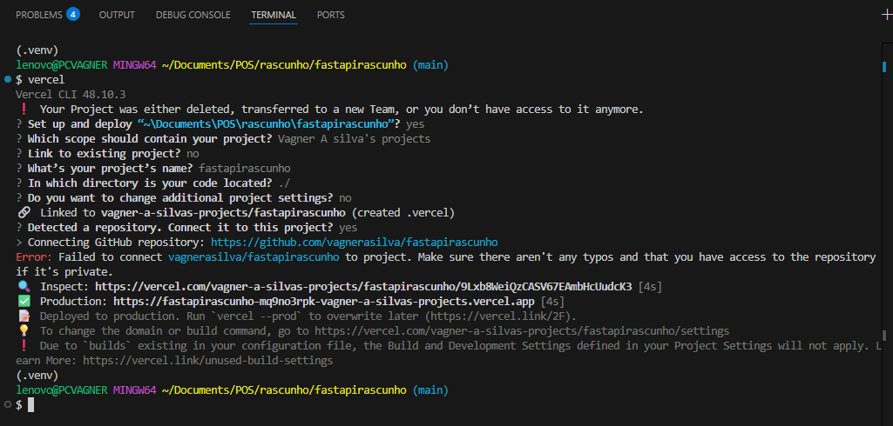
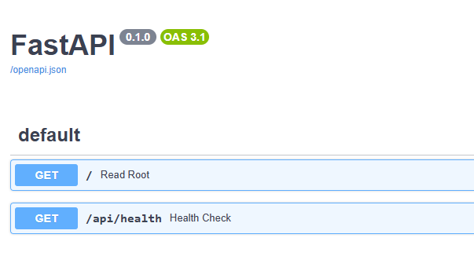

# 📖 Tutorial: Deploy de FastAPI com Vercel Localmente

Este guia mostra como configurar e rodar uma aplicação **FastAPI** usando **Vercel** no ambiente local.
## ⚙️ Pré-requisitos

- Python 3.9+ instalado  
- Conta no [Vercel](https://vercel.com)  
- Instale o **Vercel CLI**:
  ```bash
  npm install -g vercel
  ```
- Instale o **FastAPI** e o **Uvicorn**:
  ```bash
  pip install fastapi uvicorn
  ```

Obs: use o `requirements.txt` para instalar os pacotes Python:

```
fastapi==0.104.1
uvicorn==0.24.0
```

---

# Tutorial de como fazer deploy usando Vercel localmente

## 1 - Criar aplicação FastAPI

Para funcionar uma aplicação FastAPI é necessário usar o **uvicorn**, que oferece o servidor na porta principal.

Crie o arquivo `main.py`:

```python
from fastapi import FastAPI

app = FastAPI()

@app.get("/")
def read_root():
    return {"message": "Look Ma, I'm deployed!"}

@app.get("/api/health")
def health_check():
    return {"status": "healthy"}

# Importante para poder funcionar na porta principal do Vercel 
if __name__ == "__main__":
    import uvicorn
    uvicorn.run(app, host="0.0.0.0", port=8000)
```

---

## 2 - Criar o arquivo de configuração do Vercel

Crie o arquivo `vercel.json`:

```json
{
  "version": 2,
  "builds": [
    {
      "src": "main.py",
      "use": "@vercel/python"
    }
  ],
  "routes": [
    {
      "src": "/(.*)",
      "dest": "main.py"
    }
  ]
}
```

> **Obs:** Note que o arquivo principal do Python é o `main.py`, que está sendo jogado na rota principal.

---

## 3 - Estrutura básica do repositório

```
project/
│── main.py
│── requirements.txt
│── vercel.json
```

---

## 4 - Deploy usando a CLI do Vercel

Faça login e realize o deploy:

```bash
# Log in via CLI
vercel login

# Deploy
vercel
```

---

## 🎉 Resultado

Quando vc digitar o vercel login e depois vercel, ira acontecer uma serie de perguntas que vao te guiar ao deploy da aplicacao e por fim gerar um endpoint.



[App principal ](https://fastapirascunho-mq9no3rpk-vagner-a-silvas-projects.vercel.app)
{"message":"Look Ma, I'm deployed!"}


[/api/health ](https://fastapirascunho-mq9no3rpk-vagner-a-silvas-projects.vercel.app/api/health)
{"status":"healthy"}


[Docs ](https://fastapirascunho-mq9no3rpk-vagner-a-silvas-projects.vercel.app/docs)

